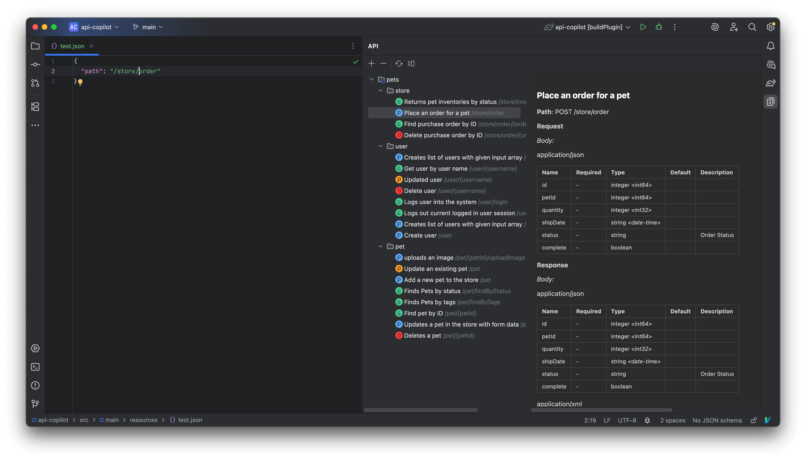

# Apix

An API workbench for JetBrains IDEs.

## Features

- OpenAPI, SwaggerHub, and Apifox document support.
- API tree navigation and documentation preview.
- Quick API search.
- Path completion in string literals.
- Jump to API documentation from paths.
- API request debugging.
- Code generation.

## Usage

1. Add an API document in the API tool window.
2. Press `Ctrl + \` to search APIs.
3. Type `/` inside string literals to trigger path completion.
4. Use `Ctrl + click` to jump to API documentation.
5. Select APIs and click `Generate Code` in the API tool window toolbar.

## License

Licensed under the Apache License 2.0.
